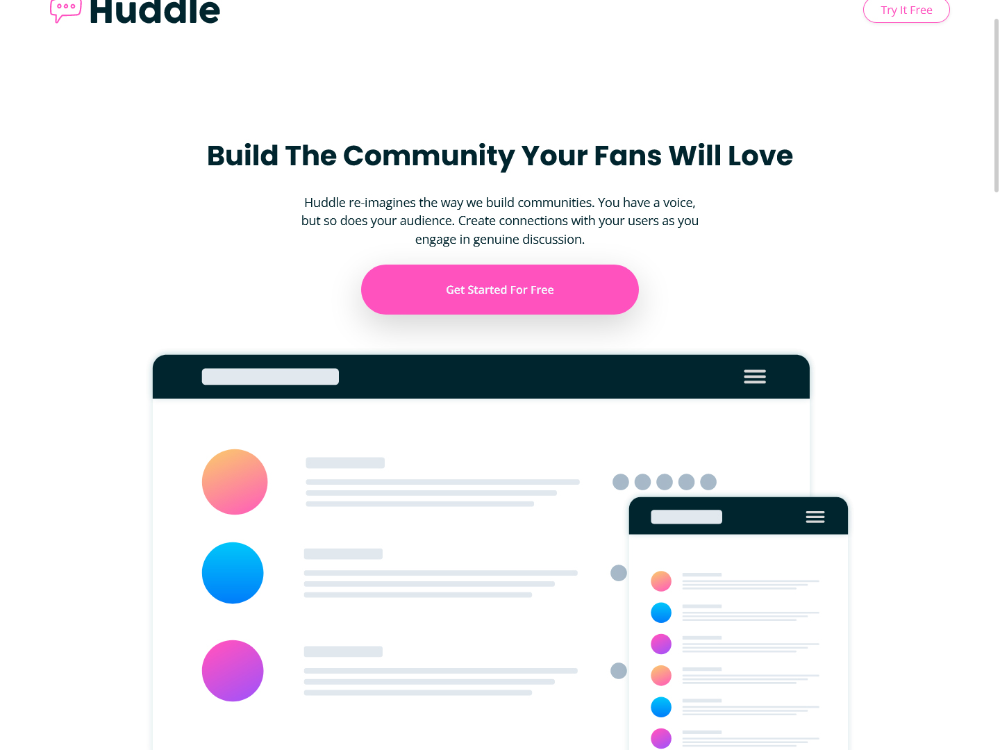

# Frontend Mentor - Huddle landing page with curved sections solution

This is a solution to the [Huddle landing page with curved sections challenge on Frontend Mentor](https://www.frontendmentor.io/challenges/huddle-landing-page-with-curved-sections-5ca5ecd01e82137ec91a50f2). Frontend Mentor challenges help you improve your coding skills by building realistic projects. 

## Table of contents

- [Overview](#overview)
  - [The challenge](#the-challenge)
  - [Screenshot](#screenshot)
  - [Links](#links)
- [My process](#my-process)
  - [Built with](#built-with)
- [Author](#author)

## Overview

### The challenge

Users should be able to:

- View the optimal layout for the site depending on their device's screen size
- See hover states for all interactive elements on the page

### Screenshot

### Links

- Solution URL: [Code](https://github.com/Z-ayat/huddle-landing-page-with-curved-sections)
- Live Site URL: [Live Preview](https://z-ayat.github.io/huddle-landing-page-with-curved-sections/)

## My process

### Built with

- Semantic HTML5 markup
- CSS custom properties
- Flexbox
- CSS Grid
- Mobile-first workflow
- [Bootstrap 5](https://getbootstrap.com/docs/5.1/getting-started/introduction/) - Bootstrap 5
- [Icomoon](https://icomoon.io/app/#/select) - Icomoon Lib

## Author

- Frontend Mentor - [@Z-ayat](https://www.frontendmentor.io/profile/Z-ayat)
- Twitter - [@AliElZayat9](https://twitter.com/AliElZayat9)